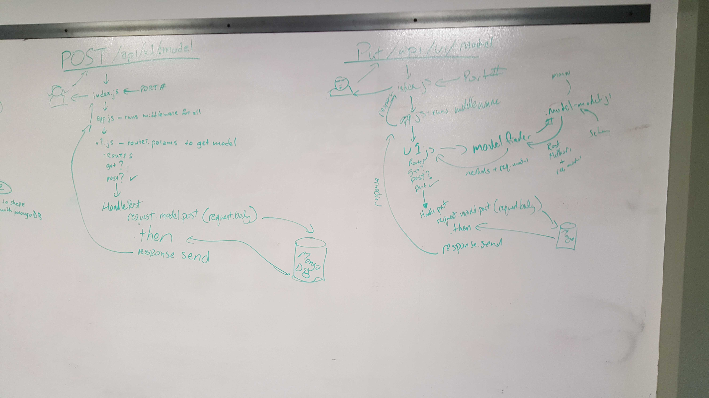
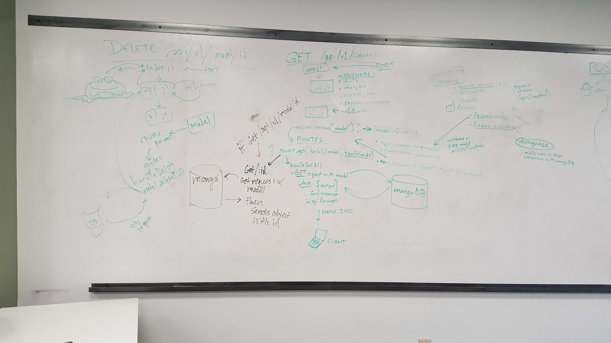

 LAB
=================================================

## Lab09

### Spencer Hirata

### Links and Resources
* [repo](https://github.com/401-advanced-js/lab-09/pull/1)

* [back-end](https://sh-lab09.herokuapp.com/) (when applicable)

#### Documentation
* [swagger](https://sh-lab09.herokuapp.com/swagger)
* [jsdoc](https://sh-lab09.herokuapp.com/jsdoc)

### Modules
#### `modulename.js`
##### Exported Values and Methods

###### `foo(thing) -> string`
Usage Notes or examples

###### `bar(array) -> array`
Usage Notes or examples

### Setup
#### `.env` requirements
* `PORT` - Port Number
* `MONGODB_URI` - URL to the running mongo instance/db

#### Running the app
* `npm start`
* Endpoint: `/foo/bar/`
  * Returns a JSON object with abc in it.
* Endpoint: `/bing/zing/`
  * Returns a JSON object with xyz in it.
  
#### Tests
* How do you run tests?
* What assertions were made?
* What assertions need to be / should be made?

#### UML

